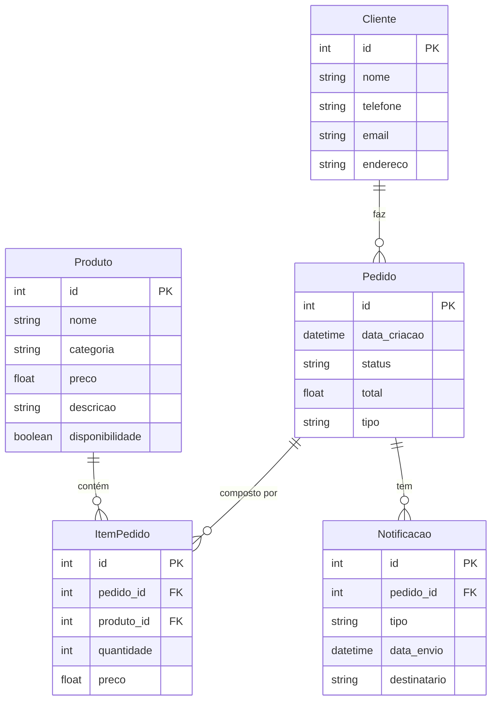

# Gerenciamento de Pedidos para Restaurante

Este projeto é um sistema de gerenciamento de pedidos para restaurantes. Ele permite que o restaurante controle os pedidos de clientes, a disponibilidade dos produtos, e o envio de notificações para clientes e para a cozinha.

## Funcionalidades

1. **Cadastro de Produtos**: Permite registrar produtos do cardápio com informações como nome, categoria, preço, descrição e disponibilidade.
2. **Gestão de Pedidos**: Criação e atualização de pedidos dos clientes, incluindo o tipo (para entrega ou consumo no local) e o status (em andamento, pronto, concluído).
3. **Controle de Itens de Pedido**: Gerenciamento dos itens individuais em um pedido, permitindo especificar quantidade e preço para cada item.
4. **Cadastro de Clientes**: Permite o registro de informações dos clientes, como nome, telefone, email e endereço (para pedidos de entrega).
5. **Sistema de Notificações**: Envio de notificações sobre o status do pedido para a cozinha e para o cliente.

## Tecnologias Utilizadas

- **Java**: Linguagem principal do sistema.
- **Spring Framework**: Framework para criar a camada de serviço e persistência de dados.
- **Spring Boot**: Para simplificar a configuração e a inicialização da aplicação.
- **Hibernate**: Para o mapeamento objeto-relacional (ORM).
- **MySQL**: Banco de dados relacional utilizado para armazenar as informações do sistema.
- **Mermaid**: Utilizado para criar o diagrama de entidade e relacionamento (ER) do sistema.

## Como Rodar o Projeto na sua Máquina

1. **Pré-requisitos**:
   - [Java JDK 11+](https://www.oracle.com/java/technologies/javase-jdk11-downloads.html)
   - [Maven](https://maven.apache.org/download.cgi)
   - [MySQL](https://dev.mysql.com/downloads/)
   - [Git](https://git-scm.com/)

2. **Clone o repositório**:
   ```bash
   git clone https://github.com/anaclaracald/gerenciamento-pedidos.git
   cd gerenciamento-pedidos
   ```

3. **Configuração do Banco de Dados**:
   - Crie um banco de dados MySQL chamado `gerenciamento_pedidos`.
   - No arquivo `src/main/resources/application.properties`, configure as credenciais do MySQL:
     ```properties
     spring.datasource.url=jdbc:mysql://localhost:3306/gerenciamento_pedidos
     spring.datasource.username=seu_usuario
     spring.datasource.password=sua_senha
     spring.jpa.hibernate.ddl-auto=update
     ```

4. **Instale as dependências e compile o projeto**:
   ```bash
   mvn clean install
   ```

5. **Execute a aplicação**:
   ```bash
   mvn spring-boot:run
   ```

6. **Acesse o sistema**:
   - A aplicação estará disponível em `http://localhost:8080`.

### Diagrama de Entidade e Relacionamento (ER)


